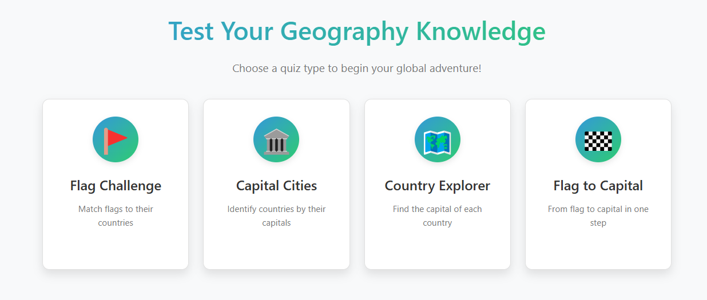

# GeoQuiz Challenge

GeoQuiz Challenge is an interactive web application that tests and improves your geography knowledge through engaging quiz games. Challenge yourself with various quiz types, track your progress, and discover new facts about countries around the world.

## Features

- **Multiple Quiz Types**:

  - **Flag Challenge**: Match flags to their countries
  - **Capital Cities**: Identify countries by their capitals
  - **Country Explorer**: Find the capital of each country
  - **Flag to Capital**: Connect flags directly to capital cities

- **Interactive Data Visualization**:

  - Performance tracking over time
  - Quiz type comparison charts
  - Score distribution analytics
  - Historical performance metrics

- **Customizable Quiz Settings**:

  - Select specific regions of the world
  - Adjust quiz difficulty
  - Choose number of questions
  - Settings remembered between sessions

- **User Stats & Progress Tracking**:

  - Detailed score history
  - Personal best records
  - Performance percentages
  - Games played counter

- **Learning Features**:

  - Contextual hints system
  - Immediate feedback on answers
  - Country information display

- **User Experience**:
  - Dark/Light mode toggle
  - Responsive design for all devices
  - Intuitive navigation
  - Clean, modern interface

## Technologies Used

- HTML5, CSS3, and JavaScript (ES6+)
- RESTCountries API for country data
- Local Storage for user data persistence
- CSS Grid and Flexbox for responsive layouts

## Development Challenges and Solutions

### Challenge 1: Preventing Duplicate Questions

Initially, the quiz would sometimes show the same country multiple times within a single quiz session. This was solved by implementing a tracking system that records which countries have already been used and ensures they don't appear again until all countries have been cycled through.

### Challenge 2: Timer Management

Early versions suffered from overlapping timers when navigating between quizzes, causing multiple timers to run simultaneously. The solution was a comprehensive timer management system that properly cleans up existing timers before starting new ones, using a global registry for tracking all active timers.

## Future Enhancements

- Additional quiz types (borders, languages, currencies)
- Global leaderboards
- Social sharing of quiz results
- Interactive world map for exploration
- Offline mode support

## [Live Demo](https://darrashumber.github.io/geo-quiz/)

## Project Demo

[Darras GeoQuiz Challenge Demo](https://www.youtube.com/watch?v=qdoFB-OvKAE)
